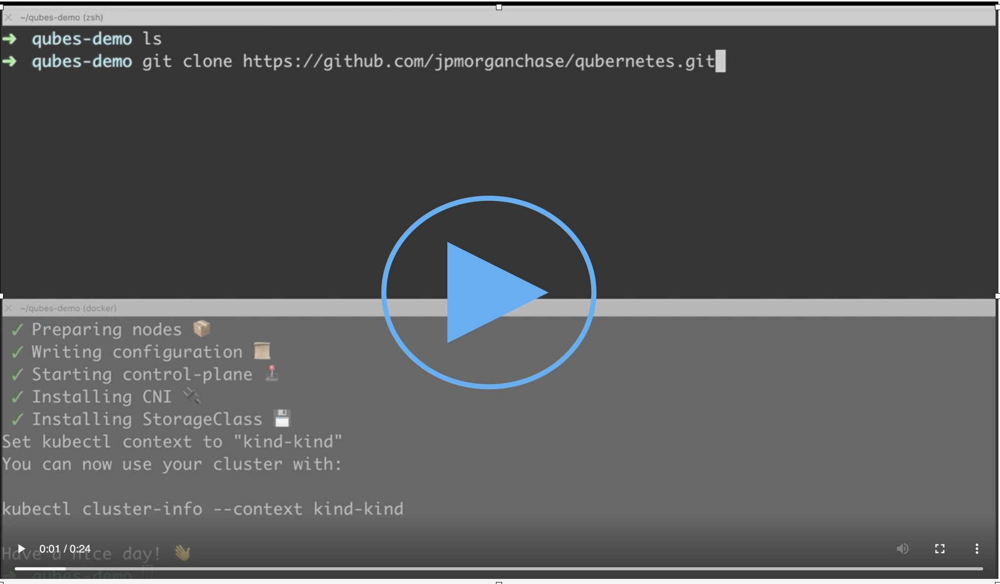
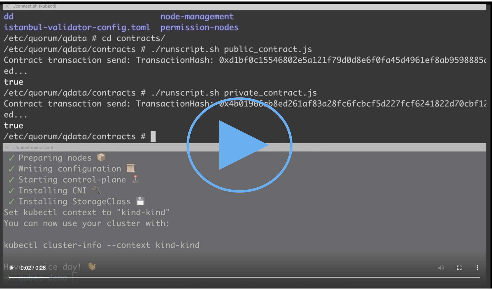
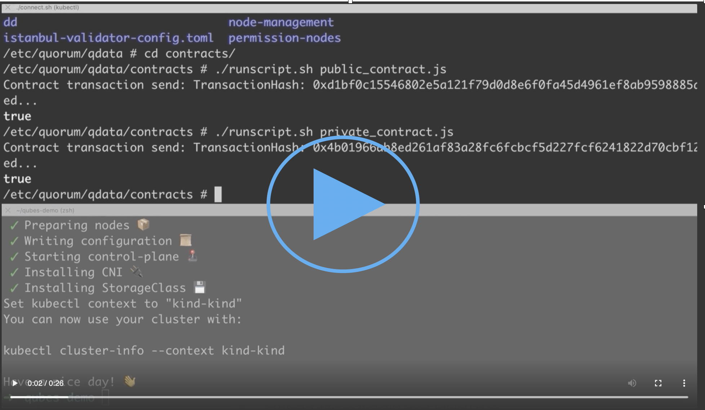
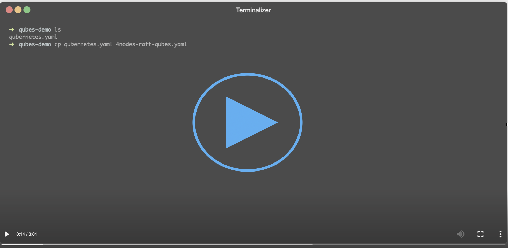
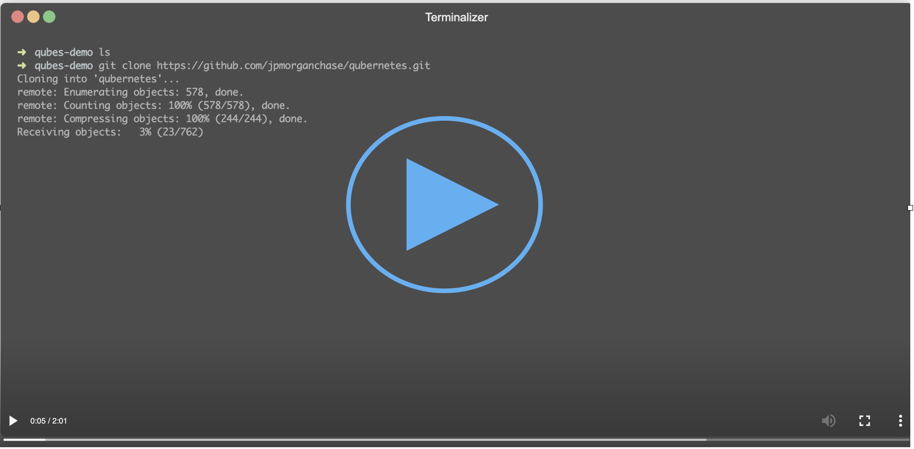
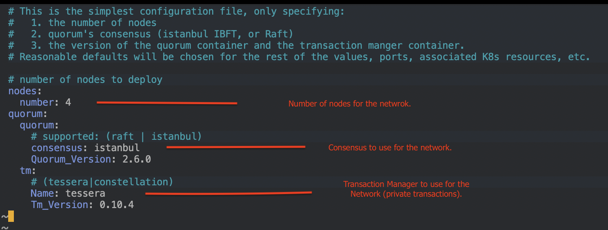
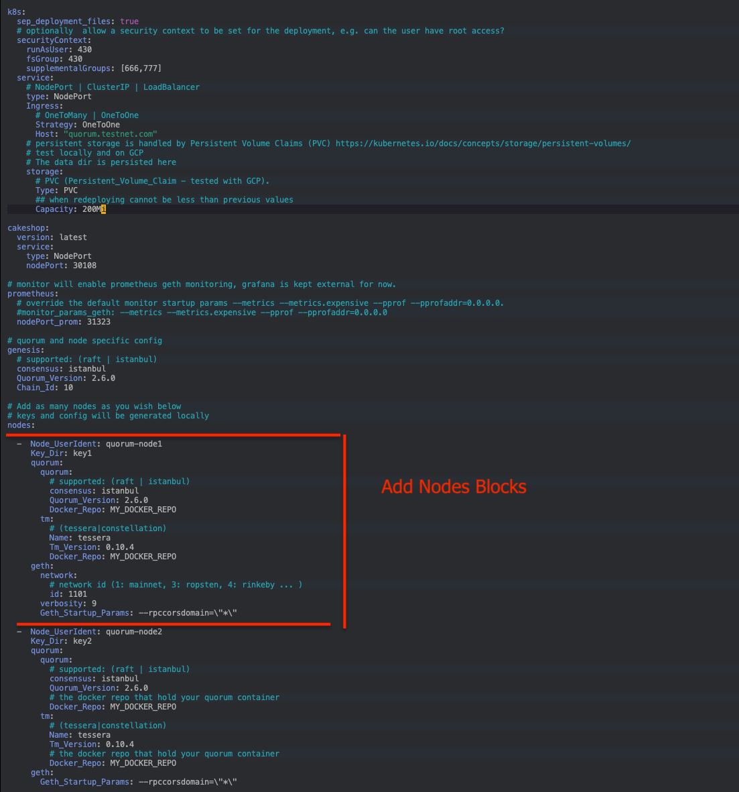

## Qubernetes

[Quorum](https://github.com/ConsenSys/quorum) on [Kubernetes](https://github.com/kubernetes/kubernetes),
including: 

* [Quickest Start](#quickest-start):    
  To deploy 7nodes Tessera with IBFT run: `./quickest-start.sh`  
  To create and deploy an N node Quorum network run: `./quickest-start.sh $NUM`   
  To terminate the network run `./quickest-stop.sh`

* [qctl](qctl): :star2:  
   Quberentes command line tool.  
   Most comprehensive way to create / interact with a quorum k8s network.  
   Quberentes command line for initializing, deploying, modifying, interacting with a quorum K8s network.  
   ```
   > qctl init
   > qclt generate netwoirk --create 
   > qctl deploy network
   ```  
   see [qctl](qctl) for full set of commands.
   
* [7 Node Example On K8s](docs/7nodes-on-k8s.md):   runs [quorum-examples](https://github.com/ConsenSys/quorum-examples/tree/master/examples/7nodes) on K8s.  
  🎬 &nbsp;&nbsp;[7nodes Demo](#-step-1-deploy-7nodes)  
  
* [N Node Quorum Network On K8s](#generating-quorum-and-k8s-resources-from-custom-configs):
  Generates the necessary Quorum resources (keys, configs - genesis, istanbul, etc.) and Kubernetes API resource yaml 
  for a configurable N node Quorum Network based on a minimal config [`qubernetes.yaml`](qubernetes.yaml).    
   
## Quickest Start
Requires docker to be running on your machine with sufficient memory ~8GB for a 7 node cluster. 
```bash
# default 4 nodes IBFT network 
$> ./quickest-start.sh
```

```bash 
# N node network
$> ./quickest-start.sh 4
```

```bash
# terminate
$> ./quickest-stop.sh
````

This:

1. Installs [Kind](https://kubernetes.io/docs/setup/learning-environment/kind/), a tool for running Kubernetes in Docker.
2. Deletes any existing kind cluster named `quickest-qube` if it exist locally.
3. Creates a new Kind cluster named `quickest-qube`.
4. Deploys a 7 node quorum network (or an N node network) configured to use Tessera as the Transaction Manager, and IBFT as the consensus algorithm.

⭕️&nbsp;&nbsp;**note**: if you experience issues with the nodes starting up, check dockers memory and/or try running a smaller network `./quickest-start.sh 3` .

## Qubernetes Command line: qctl
```
> qctl init
> qclt generate netwoirk --create 
> qctl deploy network
``` 

## Additional Resources   
* [Quickstart With Minikube](docs/minikube-docs.md):
  Quickstart for running a Quorum network on minikube.
 
* [Running On GKE](docs/gke-hosted-kubernetes.md) 

* [Quorum Network From Existing Quorum Resources](docs/qubernetes-config.md#generating-kubernetes-object-yaml-from-existing-quorum-resources):  
Generates Kuberenetes API resources from existing Quorum resources: keys, config, etc.

## Accessing Nodes on K8s
e.g. The Quorum and Transaction Manager Containers

> **Note:** The below commands assume that the quorum deployment was deployed to the `default` namespace.

```shell
$> kubectl get pods
NAME                                       READY   STATUS    RESTARTS   AGE
quorum-node1-deployment-57b6588b6b-5tqdr   1/2     Running   1          40s
quorum-node2-deployment-5f776b479c-f7kxs   2/2     Running   2          40s
....

# connnect to the running transaction manager on node1 (quorum-node1-deployment-57b6588b6b-5tqdr).
# assuming tessera was deployed as the transaction manager.
$> ./connect.sh node1 tessera
connecting to POD [quorum-node1-deployment-676684fddf-9gwxk]
/ >

# connect to the running quorum container
$> ./connect.sh node1 quorum
connecting to POD [quorum-node1-deployment-676684fddf-9gwxk]
/ >

# once inside the quorum container you can run transactions and connect to the geth console.

/ > geth attach $QHOME/dd/geth.ipc
> eth.blockNumber
> 0
> exit

# create some contracts (public and private)
/ > cd $QHOME/contracts
/ > ./runscript.sh public_contract.js
/ > ./runscript.sh private_contract.js

# you should now see the transactions go through
# note: if you are running IBFT (Istanbul BFT consensus) the blockNumber will increment at the user defined  
# (configurable) time interval.

/ > geth attach $QHOME/dd/geth.ipc
> eth.blockNumber
> 2

# show connected peers
> admin.peers.length
6
> exit

```

There is also a helper to attach to the geth console directly.   
🎬 &nbsp; &nbsp;  [Geth Attach Demo](#-step-3-attach-to-the-geth-console)
```shell
# from the root of the quberenetes repository
qubernetes $>  ./geth-attach node1

 datadir: /etc/quorum/qdata/dd
 modules: admin:1.0 debug:1.0 eth:1.0 istanbul:1.0 miner:1.0 net:1.0 personal:1.0 rpc:1.0 txpool:1.0 web3:1.0

> eth.blockNumber
2

```

## Demos  

### 🎥 Step 1 Deploy 7nodes
Starts Kind K8s cluster (bottom screen) & deploy 7nodes (IBFT & Tessera)
[](https://ConsenSys.github.io/qubernetes/resources/7node-kind-to-pending.webm)

### 🎥 Step 2: Deploy a public and private transaction from node1
continued from above
[](https://ConsenSys.github.io/qubernetes/resources/7node-run-contracts.webm)

### 🎥 Step 3: Attach to the geth console
continued from above 
part 1 attach to geth from inside the container
part 2 use helper `./geth-attach node1`
[](https://ConsenSys.github.io/qubernetes/resources/7node-attach-geth.webm)

## Generating Quorum and K8s Resources From Custom Configs

Qubernetes enables the creation of customized Quorum networks run on Kubernetes, providing a configurable number of Quorum and Transaction Manager nodes, and creating the associated genesis config, transaction manager config, permissioned-nodes.json, required keys, services, etc. to start the network. 

If you have Docker installed, you are all set! Use the [Docker Bootstrap Container](#docker-bootstrap-container).

If you do not wish to install Docker, follow the instructions in [Install Prerequisites without Docker](docs/installing-on-host.md).

Once you have the prerequisites set up see [Modifying The Qubernetes Config File](#modifying-the-qubernetes-config-file) for more 
information about configuring a custom deployment.

### Docker Bootstrap Container

The Docker container `quorumengineering/qubernetes` has the necessary binaries installed to generate the necessary Quorum resources. 
If you have docker running, you don't have to worry about installing anything else.

Usage:

> **Note:** `qubernetes.yaml` is not added to the docker container, as this file will change between various deployments.

The `qubernetes.yaml` file and the desired `out` directory will need to be mounted on the `quorumengineering/qubernetes` container using `-v $PATH/ON/HOST/qubernetes.yaml:$PATH/ON/CONTAINTER/qubernetes.yaml`, e.g. `-v $(pwd)/cool-qubernetes.yaml:/qubernetes/qubernetes.yaml`, see below:
 
1.  Use the default `qubernetes.yaml` in the base of the qubernetes repository.  You may edit this file to create your custom quorum network 
```bash
$> git clone https://github.com/ConsenSys/qubernetes.git
$> cd qubernetes
qubernetes $> docker run --rm -it -v $(pwd)/qubernetes.yaml:/qubernetes/qubernetes.yaml -v $(pwd)/out:/qubernetes/out  quorumengineering/qubernetes ./qube-init qubernetes.yaml
qubernetes $> ls out 
``` 
[](https://ConsenSys.github.io/qubernetes/resources/docker-qubernetes-boot-1.webm)
2.   Generate Quorum and Kubernetes resources files from any directory using a custom configuration file, e.g. `cool-qubernetes.yaml`,
you do not need to clone the repo, but mount the file `cool-qubernetes.yaml` and the `out` directory on the `quorumengineering/qubernetes` container, 
so the resources will be available after the container exits.
```shell
# from some directory containing a config file cool-qubernetes.yaml 
myDir$> ls
cool-qubernetes.yaml

# run docker and mount cool-qubernetes.yaml and the out directory
# a prompt will appear enter 1 to Delete the 'out' directory and generate new resources. 
myDir$> docker run --rm -it -v $(pwd)/cool-qubernetes.yaml:/qubernetes/cool-qubernetes.yaml -v $(pwd)/out:/qubernetes/out quorumengineering/qubernetes ./qube-init cool-qubernetes.yaml
using config file: cool-qubernetes.yaml

 The 'out' directory already exist.
 Please select the action you wish to take:

 [1] Delete the 'out' directory and generate new resources.
 [2] Update / add nodes that don't already exist.
 [3] Cancel.

1 

# The generated files and the k8s-yaml will be in the out directory.
myDir$> ls
cool-qubernetes.yaml out

```
[](https://ConsenSys.github.io/qubernetes/resources/docker-qubernetes-boot-2.webm)

3.  Exec into the `quorumengineering/qubernetes` container to run commands inside. This is useful for testing changes 
to the local ruby generator files. 
In this example, we are running the container from inside the base qubernetes directory, and mounting the entire directory,
so it is as if we were running on our local host: the files from the host will be used, and generated files will be continue to exist after the container exists.

```
$> git clone https://github.com/ConsenSys/qubernetes.git
$> cd qubernetes 
qubernetes $> docker run --rm -it -v $(pwd):/qubernetes -ti quorumengineering/qubernetes
root@4eb772b14086:/qubernetes# ./qube-init

root@4eb772b14086:/qubernetes# ls out/
00-quorum-persistent-volumes.yaml  01-quorum-genesis.yaml  02-quorum-shared-config.yaml  03-quorum-services.yaml  04-quorum-keyconfigs.yaml  config  deployments
```
[](https://ConsenSys.github.io/qubernetes/resources/docker-qubernetes-boot-3.webm)

### Modifying The Qubernetes Config File

example [qubernetes.yaml](qubernetes.yaml) is the simpliest config, and has many defaults set for you, which can be overridden see [More Qubernetes Config Options](#more-qubernetes-config-options) 


For starters, let's see how to modify [`qubernetes.yaml`](qubernetes.yaml) to change the number of nodes deployed in your network: 
```yaml
nodes:

  - Node_UserIdent: quorum-node1
    Key_Dir: key1
    quorum:
      quorum:
        # supported: (raft | istanbul)
        consensus: istanbul
        Quorum_Version: 2.6.0
      tm:
        # (tessera|constellation)
        Name: tessera
        Tm_Version: 0.10.4

  - Node_UserIdent: quorum-node2
    Key_Dir: key2
    quorum:
      quorum:
        # supported: (raft | istanbul)
        consensus: istanbul
        Quorum_Version: 2.6.0
      tm:
        # (tessera|constellation)
        Name: tessera
        Tm_Version: 0.10.4
# add more nodes if you'd like
#  - Node_UserIdent: quorum-node5
#    Key_Dir: key5
#    quorum:
#      quorum:
#        # supported: (raft | istanbul)
#        consensus: istanbul
#        Quorum_Version: 2.6.0
#      tm:
#        # (tessera|constellation)
#        Name: tessera
#        Tm_Version: 0.10.4
```

* You can also run the `./quick-start-gen` command to generate the core config
```bash
$> ./quick-start-gen --help

Usage: ./quick-start [options]
        --consensus[ACTION]          The consensus to use for the network (raft or istanbul), default istanbul
    -q, --quorum-version[ACTION]     The version of quorum to deploy, default 2.6.0
    -t, --tm-version[ACTION]         The version of the transaction manager to deploy, default 0.10.4
        --tm-name[ACTION]            The transaction manager (tessera|constellation) for the network, default tesera
    -c, --chain_id[ACTION]           The chain id for the network manager deploy, default 1000
    -n, --num-nodes[ACTION]          The number of nodes to deploy, default 4
    -h, --help                       prints this help

$> ./quick-start-gen --chain-id=10 --consensus=raft --quorum-version=2.6.0 --tm-version=0.10.5 --tm-name=tessera --num-nodes=7
```

2. Once you have your core config, e.g. qubernetes.yaml configured with your desired parameters: 
   Run `./qube-init` to generate everything needed for the quorum deployment: quorum keys, genesis.json, istanbul-config.json, permissioned-nodes.json, etc.
  
 These resources will be written and read from the directories specified in the `qubernetes.yaml` file.
 The default [`qubernetes.yaml`](qubernetes.yaml) is configured to write theses to the `./out/config` directory.
 ```yaml
 Key_Dir_Base: out/config 
 Permissioned_Nodes_File: out/config/permissioned-nodes.json
 Genesis_File: out/config/genesis.json
 ```
 
 ```shell
 
 ## in this case, an out directory exists, so select `1`.
 $> ./qube-init qubernetes.yaml
 The 'out' directory already exist.
 Please select the action you wish to take:

 [1] Delete the 'out' directory and generate new resources.
 [2] Update / add nodes that don't already exist.
 [3] Cancel.
 
 ..
 
 Creating all new resources.
 
   Generating keys...
 INFO [01-14|17:05:09.402] Maximum peer count                       ETH=25 LES=0 total=25
 INFO [01-14|17:05:11.302] Maximum peer count                       ETH=25 LES=0 total=25
 INFO [01-14|17:05:13.160] Maximum peer count                       ETH=25 LES=0 total=25
```

 After the Quorum resources have been generated, the necessary K8s resources will be created from them and all generated files will be in the `out` directory:
```shell
# list the  generated Quorum resources
$> ls out/config
genesis.json                   key2                           key5                           key8                           tessera-config-9.0.json
istanbul-validator-config.toml key3                           key6                           nodes.yaml                     tessera-config-enhanced.json
key1                           key4                           key7                           permissioned-nodes.json        tessera-config.json

# list the Kubernetes yaml files
$> ls out
00-quorum-persistent-volumes.yaml 02-quorum-shared-config.yaml      04-quorum-keyconfigs.yaml         config
01-quorum-genesis.yaml            03-quorum-services.yaml           deployments

# list the k8s deployment files
$> ls out/deployments

# deploy the resources
$> kubectl apply -f out -f out/deployments
01-quorum-single-deployment.yaml 03-quorum-single-deployment.yaml 05-quorum-single-deployment.yaml 07-quorum-single-deployment.yaml
02-quorum-single-deployment.yaml 04-quorum-single-deployment.yaml 06-quorum-single-deployment.yaml

```

3. Once the Quorum resources have been generated, the `./qubernetes` command can be run to generate variations of the Kubernetes
Resources using those resources, e.g. `ClusterIP` vs `NodePort`. The `./qubernetes` command can be run multiple times and is idempotent as long as the 
underlying Quorum resources and your core configuration file do not change.

```shell
# Generate the Kubernetes resources necessary to support a Quorum deployment
# this will be written to the `out` dir.
$> ./qubernetes qubernetes.yaml

```
4. Deploy to your kubernetes cluster

```shell
# apply all the generated .yaml files that are in the ./out and ./out/deployments directory.
$> kubectl apply -f out -f out/deployments
```

5. Deleting the deployment 

```shell
$> kubectl delete -f out -f out/deployments
```

## More Qubernetes Config Options

The directory [examples/config](examples/config) contains various qubernetes config examples, such as adding K8s Ingress, K8s security context, etc.

example [qubes-full.yaml](examples/config/qubes-full.yaml)


## Thanks! And Additional Resources 
Thanks to [Maximilian Meister blog and code](https://medium.com/@cryptoctl) which provided an awesome starting point!
and is a good read to understand the different components.

## Getting Help
Stuck at some step? Please join our <a href="https://www.goquorum.com/slack-inviter" target="_blank" rel="noopener">slack community</a> for support.

