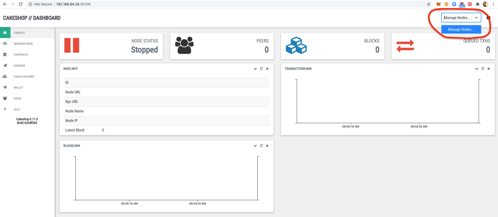
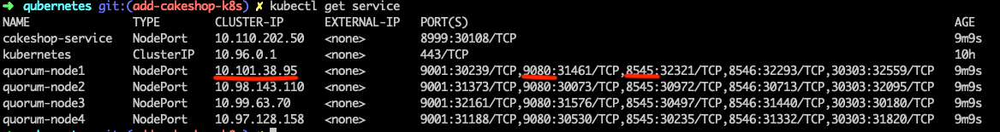
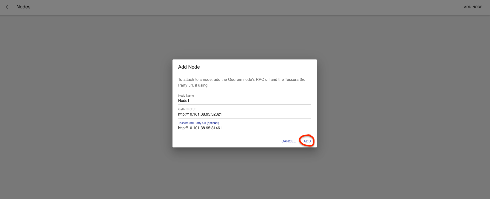

## Cakeshop Running In K8s

### Example Config
[cakeshop.yaml](../examples/config/cakeshop.yaml)

```yaml
# number of nodes to deploy
nodes:
  number: 4
quorum:
  quorum:
    # supported: (raft | istanbul)
    consensus: istanbul
    Quorum_Version: 2.6.0
  tm:
    # (tessera|constellation)
    Name: tessera
    Tm_Version: 0.10.4
cakeshop:
  version: 0.12.1
  service:
    type: NodePort
    nodePort: 30108
```

## Generate The K8s Resources
```bash
$> docker run --rm -it -v $(pwd)/cakeshop.yaml:/qubernetes/cakeshop.yaml -v $(pwd)/out:/qubernetes/out  quorumengineering/qubernetes ./qube-init cakeshop.yaml
```

## Deploy To K8s (Minikube or Other K8s runtime - not kind as kind does not support connecting to NodePorts easily)
```bash
$> kubectl apply -f out -f out/deployments
```

## Get The URL For The Cakeshop Deployment 

```bash
$> kc get services
   NAME               TYPE        CLUSTER-IP      EXTERNAL-IP   PORT(S)                                                                       AGE
   cakeshop-service   NodePort    10.110.202.50   <none>        8999:30108/TCP
```
## If Running minikube
* use `$(minikube ip):NodePort`, e.g. NodePort from above is `30108`
```bash
$> echo $(minikube ip):30108
192.168.64.25:30108
```

## If Running Docker Desktop K8s
* Your URL will be `localhost:NodePort`, e.g. `localhost:30108`

## Open In Browser And Select "Manage Nodes" (upper right corner)


## Get The Quorum Node URLs 
```bash
$> kubectl get service
   NAME               TYPE        CLUSTER-IP      EXTERNAL-IP   PORT(S)                                                                       AGE
   cakeshop-service   NodePort    10.110.202.50   <none>        8999:30108/TCP                                                                9m9s
   kubernetes         ClusterIP   10.96.0.1       <none>        443/TCP                                                                       10h
   quorum-node1       NodePort    10.101.38.95    <none>        9001:30239/TCP,9080:31461/TCP,8545:32321/TCP,8546:32293/TCP,30303:32559/TCP   9m9s
   quorum-node2       NodePort    10.98.143.110   <none>        9001:31373/TCP,9080:30073/TCP,8545:30972/TCP,8546:30713/TCP,30303:32095/TCP   9m9s
   quorum-node3       NodePort    10.99.63.70     <none>        9001:32161/TCP,9080:31576/TCP,8545:30497/TCP,8546:31440/TCP,30303:30180/TCP   9m9s
   quorum-node4       NodePort    10.97.128.158   <none>        9001:31188/TCP,9080:30530/TCP,8545:30235/TCP,8546:31332/TCP,30303:31820/TCP   9m9s
```


## Add Nodes To Cakeshop
* Use the `CLUSTER-IP` and the cluster ports for geth (default `8545`) and tessera (default `9080`)

