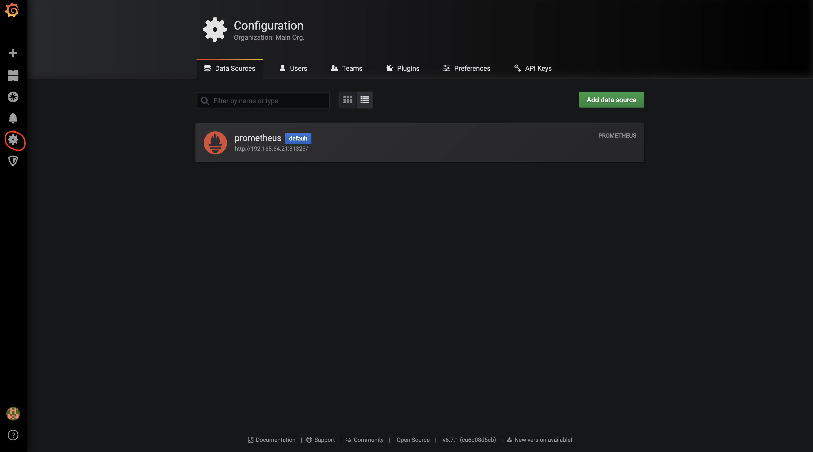
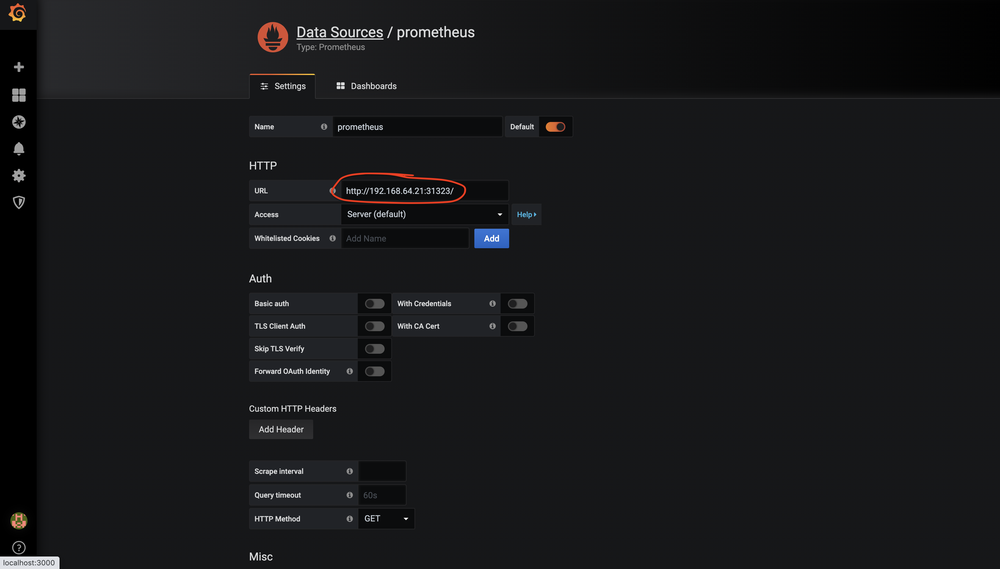
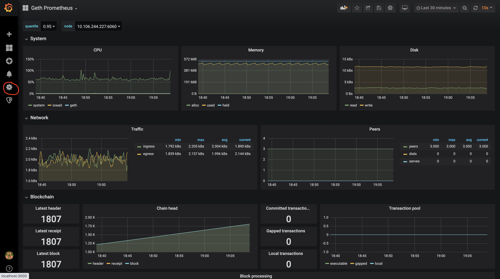

## Running Grafana with Prometheus

## Create Your K8s Cluster With Prometheus Enabled

**note** - because K8s kind does not work with NodePort. Please use minikube or a managed K8s env.

Example qubernetes.yaml config:

```yaml
# monitor will enable prometheus geth monitoring, grafana is kept external for now.
prometheus:
  # override the default monitor startup params --metrics --metrics.expensive --pprof --pprofaddr=0.0.0.0.
  #monitor_params_geth: --metrics --metrics.expensive --pprof --pprofaddr=0.0.0.0
  nodePort_prom: 31323

# quorum and node specific config
genesis:
  # supported: (raft | istanbul)
  consensus: istanbul
  Quorum_Version: 2.6.0
  Chain_Id: 10

# Add as many nodes as you wish below
# keys and config will be generated locally
nodes:

  -  Node_UserIdent: quorum-node1
     Key_Dir: key1
     quorum:
       quorum:
         # supported: (raft | istanbul)
         consensus: istanbul
         Quorum_Version: 2.6.0
       tm:
         # (tessera|constellation)
         Name: tessera
         Tm_Version: 0.10.4
     geth:
       #Geth_Startup_Params: --rpccorsdomain=\"*\" --metrics --metrics.expensive --pprof --pprofaddr=0.0.0.0
       Geth_Startup_Params: --rpccorsdomain=\"*\"

  -  Node_UserIdent: quorum-node2
     Key_Dir: key2
     quorum:
       quorum:
         # supported: (raft | istanbul)
         consensus: istanbul
         Quorum_Version: 2.6.0
       tm:
         # (tessera|constellation)
         Name: tessera
         Tm_Version: 0.10.4
     geth:
       #Geth_Startup_Params: --rpccorsdomain=\"*\" --metrics --metrics.expensive --pprof --pprofaddr=0.0.0.0
       Geth_Startup_Params: --rpccorsdomain=\"*\"

  -  Node_UserIdent: quorum-node3
     Key_Dir: key3
     quorum:
       quorum:
         # supported: (raft | istanbul)
         consensus: istanbul
         Quorum_Version: 2.6.0
       tm:
         # (tessera|constellation)
         Name: tessera
         Tm_Version: 0.10.4
     geth:
       #Geth_Startup_Params: --rpccorsdomain=\"*\" --metrics --metrics.expensive --pprof --pprofaddr=0.0.0.0
       Geth_Startup_Params: --rpccorsdomain=\"*\"

  -  Node_UserIdent: quorum-node4
     Key_Dir: key4
     quorum:
       quorum:
         # supported: (raft | istanbul)
         consensus: istanbul
         Quorum_Version: 2.6.0
       tm:
         # (tessera|constellation)
         Name: tessera
         Tm_Version: 0.10.4
```

## From Inside This Directory (qubernetes/monitor/grafana)
```bash
> docker-compose up -d
```

You should now be able to access the Grafana dashboard from [localhost:3000](http://localhost:3000) (admin:admin).

## Update The Datasource
You will need to update the datasource for prometheus from inside grafana so that the IP points to your K8s node IP, e.g. 
if running minikube run `minikube ip` to obtain the node ip.






## Stopping Grafana
```bash
> docker-compose down
```

## Demo
[](https://jpmorganchase.github.io/qubernetes/resources/grafana-demo.webm)

## Shoutout to chapsuk and karalabe for the sweet grafana databases. 
* https://github.com/chapsuk/geth-prometheus
* https://github.com/karalabe/geth-prometheus